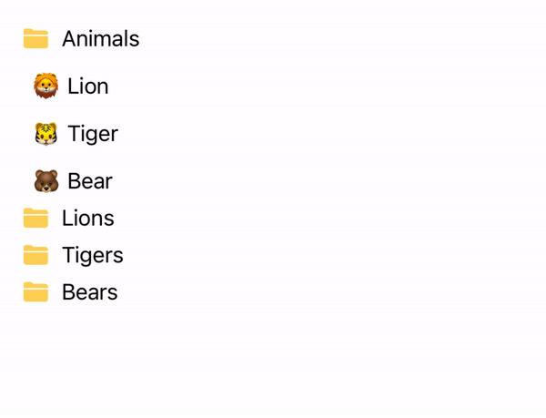
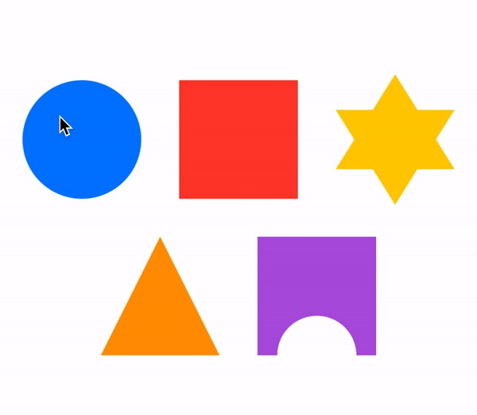
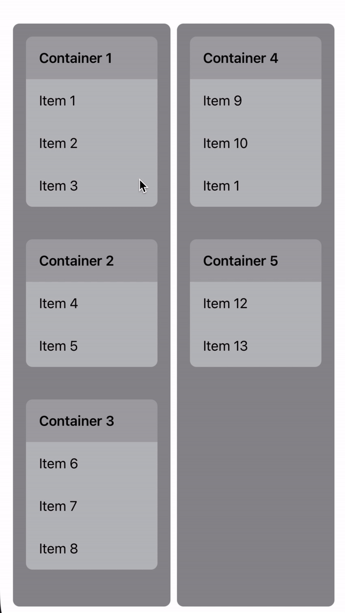

# SwiftUIJam Drag And Drop

Experimenting and playing around with drag and drop interactions in SwiftUI.

### File and Folder Example

Initially started out with a file/folder metaphor to get the initial implementation of drag and drop working.

### Drop Detection

Experimented with the ability to specify which objects can be dropped on which drop targets.

### Nested Containers

Trying something a bit more complex where draggable objects are contained within other draggable objects.

### Trello Board

Tasks were kept track of during SwiftUI Jam using a [Trello Board](https://trello.com/b/7SiisqL1/swiftuijam-draganddrop)

### Inspirations / References

[Drag and Drop in SwiftUI](https://swiftwithmajid.com/2020/04/01/drag-and-drop-in-swiftui/)

[Creating a NSItemProvider for Custom Model Class Drag and Drop API](https://exploringswift.com/blog/creating-a-nsitemprovider-for-custom-model-class-drag-drop-api)

[SwiftUI Using onDrag and onDrop](https://stackoverflow.com/questions/62606907/swiftui-using-ondrag-and-ondrop-to-reorder-items-within-one-single-lazygrid)

[SwiftUI Lab Drag and Drop with SwiftUI](https://swiftui-lab.com/drag-drop-with-swiftui/)